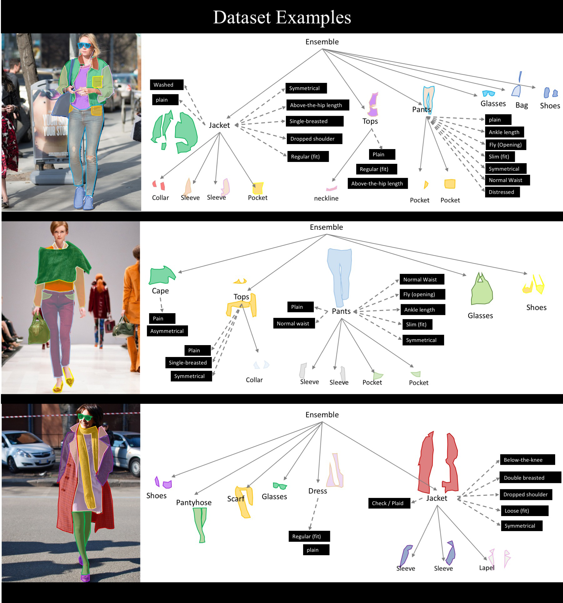

# DeepFashion2-Mask-RCNN

Implementation of Mask-RCNN on the iMaterialist (Fashion) 2020 dataset 

Mask R-CNN explained           |  Dataset description
:-------------------------:|:-------------------------:
  |  
